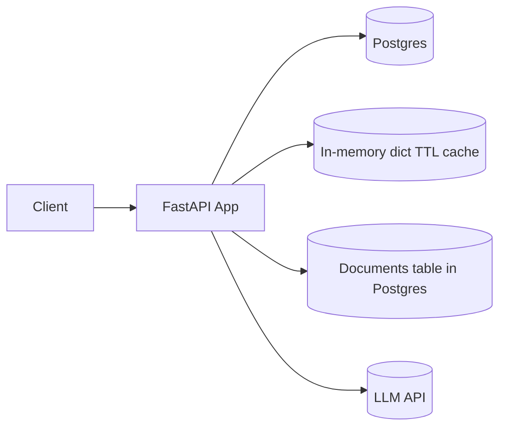

# BOT GPT – Conversational Backend (FastAPI)
## Overview
Lightweight backend for a conversational AI system supporting Open Chat and RAG (PDF ingestion).
This README is a compact design + API reference for engineers. Diagrams are Mermaid-friendly (paste into mermaid.live or mermaid.com).

This project provides a FastAPI backend that:
- Persists conversations and messages
- Supports Open Chat (LLM-only) and RAG (PDF-backed) modes
- Summarizes old messages to control token usage
- Retrieves relevant document chunks for RAG

**Contents**
- Architecture diagram (Mermaid)
- Sequence diagram (Mermaid)
- API summary
- Data schema
- LLM context & cost management
- RAG flow
- Scalability & error handling notes

---

## Quick Links
- **Code:** [app/main.py](app/main.py)
- **APIs:** [app/api/conversations.py](app/api/conversations.py), [app/api/messages.py](app/api/messages.py)
- **Services:** [app/services/conversation_service.py](app/services/conversation_service.py), [app/services/message_service.py](app/services/message_service.py)

## Architecture (high level)
Client -> FastAPI routers -> Services (conversation/message/rag) -> LLM / PDF service


**Architecture (compact)**



---

**Sequence diagram (message send)**

Paste to mermaid.live; script below:


---

**API summary (quick)**

- POST /conversations
  - Body: { user_email, title?, mode: open|rag }
  - Response: { id, user_id, mode, created_at }

Small diagrams for these endpoints (paste to mermaid.live):

POST /conversations


POST /conversations/{id}/messages


- GET /conversations?user_email=...
  - Response: list of conversation summaries

- GET /conversations/{id}
  - Response: conversation with messages (paginated)

- DELETE /conversations/{id}
  - Auth required (X-User-Email)

- POST /conversations/{id}/messages
  - Form: content (string), file (optional PDF, only allowed in `rag` mode)
  - Headers: X-User-Email for ownership check
  - Response: persisted assistant message

Notes: endpoints enforce `conversation.user_id == current_user.id`. LLM calls are awaited by the message processing service which runs asynchronously.

---

**Data model (concise)**

Tables:

users(id PK, email UNIQUE, created_at)

conversations(id PK, user_id FK, title, mode, summary, messages, created_at)

messages(id PK, conversation_id FK, role TEXT, content TEXT, created_at created_at TIMESTAMP)

documents(id PK, filename, content TEXT, created_at)

conversation_documents(id PK, conversation_id FK, document_id FK)

---

**LLM Context & Cost Management**

How context is constructed:
1. System prompt / instructions
2. RAG context (top_k chunks retrieved from `documents` linked to the conversation) — only when mode == `rag`
3. Recent raw messages (sliding window)
4. Summaries for older history
5. Latest user message

When history exceeds model limits:
- Apply windowing: keep last M raw messages
- Replace older messages with a periodic summary message
- Optionally compress older history (summarize then store)

Cost-reduction strategies:
- Use cheaper/smaller models for summarization and reranking
- Summarize older history in background, not on every request
- Cache LLM responses for repeated prompts
- Limit `max_tokens` and tune stop sequences
- Batch or queue heavy LLM tasks and use async workers

---

**RAG flow (brief, current implementation)**

1. Ingest PDF -> extract text -> chunk (configurable size) -> store chunks as `documents` rows linked to the conversation
2. At query: retrieve relevant chunks from `documents` using simple substring/ranking heuristics (our `rag_service`) — no vector DB in this implementation
3. Provide top_k chunks as context to the LLM

Implementation note: this repo uses a DB-backed document store and a simple retriever. If you need vector similarity at scale, consider adding a vector DB later.

---

**Scaling & bottlenecks**

Primary bottlenecks at large scale (1M users):
- LLM throughput and token cost
- DB write/read throughput for messages and documents
- Document retrieval latency (if many large documents per conversation)

Scaling strategies (suggesting by learnings with experience and theoritical understanding of the systems):
- App: horizontal stateless FastAPI instances behind a load balancer
- DB: read replicas, partitioning (by user or time), sharding for writes
- LLM: queue calls, worker autoscaling, use cheaper models as fallback
- Use caching (in-memory dict cache) for hot conversations and recent messages

Pattern: Prefer CQRS for separation of read/write workloads and background workers for heavy tasks (summaries, embeddings, PDF processing).

---

**Operational & error handling**

- Timeouts and circuit breakers for external LLM providers
- Retries with exponential backoff for transient failures
- Idempotency support for message ingestion
- Monitor token usage, latency, and error rates; add quotas & rate-limiting per user


## Additional implementation notes

- **Auth:** Protected endpoints expect `X-User-Email` header and enforce ownership for conversation reads/updates/deletes and message posting. See [app/api/deps.py](app/api/deps.py).
- **Caching:** A simple in-memory cache is used for `get_conversation` to reduce DB hits. See [app/db/cache.py](app/db/cache.py). Cache is invalidated when conversations or messages change.
- **Logging:** Basic application logging is configured in [app/main.py](app/main.py). Handlers and services log key events.
- **Async LLM calls:** `app/services/llm_service.py` exposes an `async call_llm(...)` entrypoint; `message_service.process_user_message` awaits it so handlers are non-blocking.

## Running locally
1. Create venv: `python -m venv venv`
2. Activate: `source venv/bin/activate`
3. Install: `pip install -r requirements.txt`
4. Run: `uvicorn app.main:app --reload`
5. Open API docs: `http://localhost:8000/docs`

Environment

- Create a `.env` file in the project root with one value:

```
GROQ_API_KEY=<groq-key-here>
```

- Get a key from: https://console.groq.com/keys

## Tests
- Run: `PYTHONPATH=$PWD pytest -q`

## Docker
- Build: `docker build -t bot-gpt .`
- Run: `docker run -p 8000:8000 bot-gpt`

## Notes & future improvements
- Async LLM calls, streaming, auth, background PDF processing.

## Demo Video

A short demo video showcasing:
- Creating a conversation in **RAG** mode
- Sending messages by choosing the conversation.
- Uploading a **PDF document** and using it in context.
- Touch few other APIs as well.

👉 **Watch the demo here:**  
[Demo Video – BOT GPT Backend](https://drive.google.com/file/d/1q6YQBfrQ8qXeWD_rpKwXGYdj3nkuLa9C/view?usp=drive_link)

> The demo is recorded using FastAPI UI docs to demonstrate backend APIs without any frontend.


## API Endpoints (with curls)

- **Create conversation**: `POST /conversations`
  - Body: `{ "user_email": "...", "mode": "open"|"rag", "title": "optional" }`
  - See: [app/api/conversations.py](app/api/conversations.py)

  Example cURL:

```
curl -X 'POST' \
  'http://localhost:8000/conversations' \
  -H 'accept: application/json' \
  -H 'Content-Type: application/json' \
  -d '{
  "user_email": "abc@ok.com",
  "mode": "rag",
  "title": "this is my first rag chat"
}'
```

- **List conversations**: `GET /conversations?user_email=...&limit=20&offset=0`

  - Authentication: Requires header `X-User-Email` matching `user_email`.
  - Example cURL:

```
curl -X 'GET' \
  'http://localhost:8000/conversations?user_email=abc%40ok.com&limit=20&offset=0' \
  -H 'accept: application/json'
```

- **Get conversation**: `GET /conversations/{conversation_id}`

  - Authentication: Requires header `X-User-Email` and the conversation must belong to that user.
  - Example cURL:

```
curl -X 'GET' \
  'http://localhost:8000/conversations/8' \
  -H 'accept: application/json'
```

- **Delete conversation**: `DELETE /conversations/{conversation_id}`

  - Authentication: Requires header `X-User-Email` and ownership check.

  - Example cURL:

```
curl -X 'DELETE' \
  'http://localhost:8000/conversations/7' \
  -H 'accept: application/json'
```

- **Send message**: `POST /conversations/{conversation_id}/messages`
  - Form fields: `content` (string), optional `file` (PDF — only allowed when conversation.mode == `rag`)
  - See: [app/api/messages.py](app/api/messages.py)

  - Authentication: Requires `X-User-Email` header and ownership check.
  - Note: LLM calls are performed asynchronously; the endpoint awaits the response but the implementation uses a mocked async LLM client.

  Example cURL (RAG + PDF):

```
curl -X 'POST' \
  'http://localhost:8000/conversations/8/messages' \
  -H 'accept: application/json' \
  -H 'x-user-email: abc@ok.com' \
  -H 'Content-Type: multipart/form-data' \
  -F 'content=summarise the data please' \
  -F 'file=@bhuvanesh_tiwari_resume.pdf;type=application/pdf'
```
